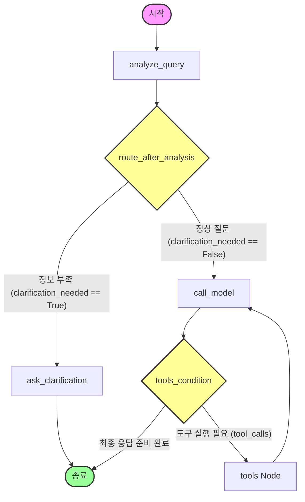

# MixMaster AI (LangChain 기반 RAG 믹싱 에이전트)

본 프로젝트는 오디오 엔지니어링 및 믹싱에 입문하거나 어려움을 겪는 사용자들을 위해, Wikipedia의 공신력 있는 음향 자료들과 실용적인 오디오 계산기 도구를 결합하여 맞춤형 사운드 믹싱 가이드를 제공하는 자율형 LangGraph AI 에이전트입니다.

---

## 1. 서비스 소개 및 사용 시나리오

### 💡 서비스 소개
사용자가 직면한 음향 문제(예: "보컬이 너무 먹먹해요", "드럼 드럼 소리가 뒤섞여요")를 자연어로 질문하면, 에이전트가 이를 분석해 필요한 정보를 RAG(검색) 혹은 연산 도구(BPM 딜레이 계산기)를 통해 수집하고 구조화된 전문 조언을 제공합니다.

### 🎬 주요 사용 시나리오
1. **음향 문제 해결 (Troubleshooting)**
   - "보컬 소리가 너무 웅웅거려요. 어떤 주파수를 깎아야 하나요?"
   - 에이전트가 음향 지식 베이스(Wikipedia: Audio Mixing, Equalization)를 조회하여 200Hz-500Hz 대역의 로우-컷(High-pass Filter) 및 벨 커브 EQ 감쇠 방안을 제시합니다.
2. **딜레이 시간 연산 (BPM Delay Calculator)**
   - "120 BPM 하우스 장르의 노래에서 1/8 박자 딜레이와 적정 리버브 프리딜레이 값을 계산해 줘."
   - 에이전트가 템포(BPM)를 인지하고 `calculate_delay_time` 도구를 자율 실행하여 정확한 밀리초(ms) 단위 설정값을 반환합니다.
3. **멀티턴 상세 질문 (Multi-turn Memory)**
   - (이전 질문에 이어) "방금 알려준 설정에서 템포를 80 BPM으로 늦추면 어떻게 설정값이 달라져?"
   - 에이전트가 세션(Thread ID) 메모리를 기반으로 이전 템포 설정을 기억한 채 변동된 연산 결과를 연속적으로 대답합니다.

---

## 2. 전체 아키텍처 및 흐름도 (Workflow 다이어그램)

에이전트는 **LangGraph의 StateGraph**를 기반으로 자율 의사 결정을 하도록 설계되었습니다.



### ⚙️ 흐름 설명
1. **`analyze_query`**: 사용자 쿼리를 받아 카테고리를 분류하고, 역질문이 필요한 모호한 질문인지 Pydantic으로 분석합니다.
2. **`route_after_analysis`**: 분석 결과를 기반으로 조건부 분기(Conditional Edge)를 통해 역질문을 던질지(`ask_clarification`) 모델 메인 루프(`call_model`)로 갈지 결정합니다.
3. **`call_model`**: 필요한 경우 도구를 호출하도록 모델을 호출하고, `tools_condition`을 통해 도구 실행 노드로 빠집니다.
4. **`tools`**: RAG 검색(`search_audio_knowledge`) 또는 딜레이 연산(`calculate_delay_time`) 도구를 자율적으로 선택하여 실행하고, 결과를 모델에 다시 넘깁니다.

---

## 3. 핵심 기술 요소 설명 (Tool / RAG / Memory / Middleware)

### 🛠️ 자율 선택 Tool
* **`search_audio_knowledge(query)`**: Chroma 벡터 DB(음향 Wikipedia 기반)로부터 가장 연관성 높은 3개의 문서 청크를 수집하는 RAG 도구입니다.
* **`calculate_delay_time(bpm)`**: 입력받은 BPM을 바탕으로 `60,000 / BPM` 수식을 활용하여 1/2, 1/4, 1/8, 1/16, 1/32 음표의 길이(ms)와 추천 프리딜레이 길이를 반환하는 산술 연산 도구입니다.

### 📚 RAG 파이프라인
* **데이터 인프라**: Wikipedia API를 이용해 Equalization, Compression, Reverb, Limiter 등 50여 개 이상의 전문 음향 기술 문서 수집.
* **임베딩 및 저장소**: `gemini-embedding-2` 모델을 통해 벡터화 후 `Chroma DB` 로컬 저장소에 영구 보존 및 유사도 매칭 수행.

### 🧠 대화 이력 (Memory)
* `langgraph.checkpoint.memory.MemorySaver`를 도입하여, FastAPI 요청 시 전달되는 `thread_id`별 세션 정보를 추적합니다.
* 사용자와 모델 간 주고받은 `HumanMessage`, `AIMessage`, `ToolMessage`의 누적 히스토리가 제미나이의 역할(Role) 순서 제약 조건에 어긋나지 않도록 엄격히 보장하여 멀티턴 대화의 안정성을 높였습니다.

### 🛡️ Middleware 및 안정성 적용
* **Audit 미들웨어 (FastAPI)**: HTTP 통신의 응답 소요 시간을 밀리초 단위로 측정하여 로그에 기록하며, 예기치 못한 API 서버 예외 발생 시 에러 핸들링 역할을 함께 수행합니다.
* **입력 검증 가드레일**: `BAD_WORDS` 필터를 구축하여 부적절한 단어나 비속어 쿼리가 인입될 시 사전에 차단하고 400 Bad Request 에러를 즉각 반환합니다.
* **Pydantic OutputParser**: 사용자의 최초 쿼리 분석 시 일관된 구조화(JSON) 출력을 강제하여 안정적인 라우팅 제어 흐름을 달성했습니다.

---

## 4. 설치 및 실행 방법

### 1) 환경 변수 설정
프로젝트 루트 폴더에 `.env` 파일을 생성하고 구글 제미나이 API 키를 입력합니다.
```env
GEMINI_API_KEY=your_gemini_api_key_here
```

### 2) 패키지 설치
```bash
pip install -r requirements.txt
```

### 3) API 서버 실행
```bash
python3 -m uvicorn app:app --app-dir src --reload --port 8000
```
웹 브라우저를 열고 `http://localhost:8000`에 접속하면 시각적인 웹 UI 프론트엔드를 이용할 수 있습니다.

---

## 5. 한계점 및 향후 개선 방향
* **RAG 컨텍스트의 정교성**: Wikipedia 영문 문서 위주로 색인되어 있어, 한국어 질문에 대한 번역 질의 확장을 추가하거나 한국어로 쓰인 오디오 엔지니어링 강의 문서를 벡터 DB에 추가 통합하면 보다 신뢰성 있는 현업 중심의 지식 응답이 가능할 것입니다.
* **웹 검색 연동**: 사내 로컬 RAG DB 외에도 최신 상용 플러그인(FabFilter, Waves, Soundtoys 등)의 릴리즈 노트와 트렌드를 실시간으로 리트리브할 수 있는 `Tavily` 웹 검색 기능과의 결합이 권장됩니다.
